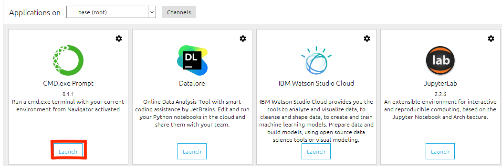

# Installing-OSMnx-on-Windows
This is a step-by-step approach to installing the Open Street Map (OSMnx) library for python using conda. These are personal steps I took to install the library after several unsuccessful attempts. I hope this repository is worth the reading. 

## Introduction
[Geoff Boeing](https://github.com/gboeing) has written extensively on Open Street Map and this article mirrors the work of Geoff. This repo takes a vivid look at installing the OSMnx library on a windows computer but the process indicated here can be replicated on Mac.

## What you need to get started
1. An updated version of Anaconda is suitable.
2. A good internet connection because of the packages that will be downloaded
3. Enough space on your local computer

## Let's get started
* Visit [here](https://github.com/gboeing/osmnx-examples) to see documentation and installation instructions. Scroll down to “More info:” and click on Documentation as shown below. This will open the documentation.

* At the documentation webpage, scroll to installation.

* The installation has to be done in the base/root terminal. There’re two ways to go about this (which is really cool for Windows), 1. Click the home button, search for Anaconda (mostly appears as a folder) click the drop-down and click Anaconda Prompt or 2. Run anaconda and launch the CMD.exe prompt to directly work in the base terminal (pretty easy huh!).

* Next, copy ‘conda config --prepend channels conda-forge’ and paste in the base terminal, and hit enter. 

* When the forge is done, copy and paste ‘conda create -n ox --strict-channel-priority osmnx’ and hit enter to install the osmnx packages. If prompted to press [y/n] to proceed, press ‘y’ to continue.
* This could take a while depending on the speed on of the internet and the packages being installed.
* When the installation is complete (in the terminal), an instruction will be given to activate the environment.
* When done, head to the Anaconda navigator and confirm if the installation worked. Next to “Applications on” is a box that displays the base root and a drop-down icon. Click on the icon to see “ox” installed.

* Click on “ox”. This will tell anaconda to switch to the ox base/ root and this will be mirrored in the terminal as well and it will take some time but not too much.
* The ox will require you to install jupyter notebook for that environment, do just that
* Finally, open a notebook and import osmnx as ox and try some examples in the [repo](https://geoffboeing.com/2016/11/osmnx-python-street-networks/).
* I hope every works fine :)

## Caveats
* Do not try to pip install osmnx directly in jupyter notebook unless you know what you’re doing.
* Make sure you’re in the ox environment.
* Keep the terminal running, do not close it just yet.
* If you encounter **ImportError: cannot import name ‘gcd’ from fractions**, don’t panic; from the ox terminal, do a “pip3 install networkx==2.5”

## Conclusion
Working with Open Street Map (OSM) is amazing when working with maps and getting information from a location from the comfort of your computer. This repo is for windows but same procedure can be followed for mac users. I must state unequivocally that this is not the only way to install osmnx on a local computer, you can also mount osmnx on a docker and run it in your notebook.
